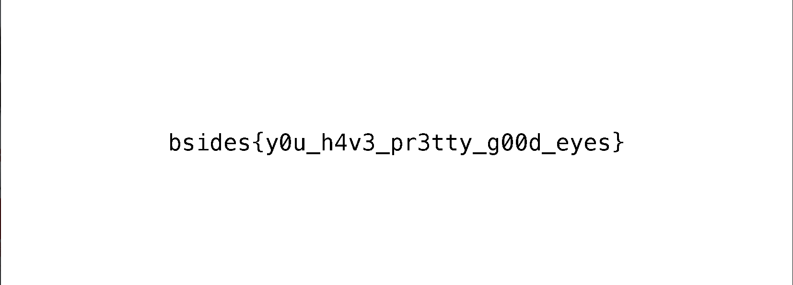

We were given the following image to work with:

I felt like Aperisolve is a great platform to use in order to start the flag hunting process, however I was not expecting to find the flag so soon ;)

The flag was pretty clear to see, as it was only visible in specific bitplanes.

Here is the result:

Thanks for reading and keep hacking :)
